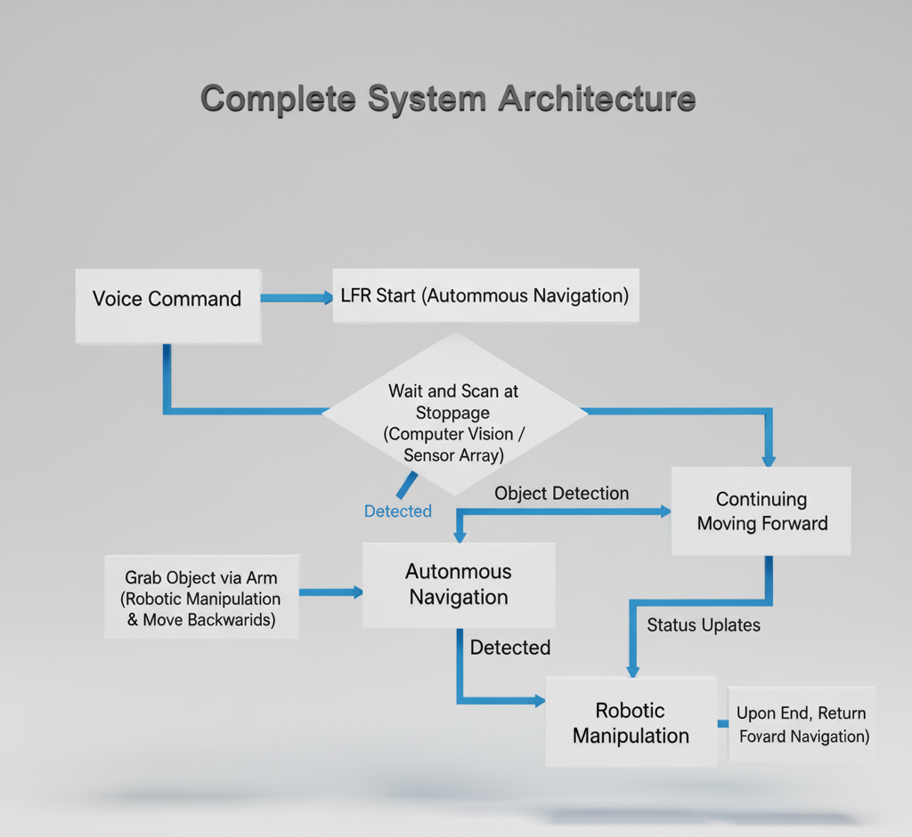

# Smart Inventory Management System

An integrated, low-cost smart inventory management system using **YOLOv5** for object detection, **Google Speech API** for voice commands, a **6-DOF robotic arm**, and an **autonomous line-following AGV**. Built on **Raspberry Pi + Arduino** for small-to-medium warehouse automation.

> Total prototype cost: ~$370 USD  
> Real-time operation | Voice-controlled | Modular design



##  Features

- Real-time object detection using YOLOv5 (COCO dataset)
- Hands-free voice command interface (English)
- Autonomous navigation via 5-sensor IR line-following
- 6-DOF robotic arm for pick-and-place operations
- Live video streaming over TCP
- Distributed control: Raspberry Pi (AI/voice) + Arduino (real-time control)

##  Hardware Requirements

- Raspberry Pi 4 (4GB RAM)
- Arduino Uno R3
- 6-DOF Robotic Arm Kit (MG996R/SG90 servos)
- AGV chassis with DC motors + L298N driver
- 5x IR line sensors
- USB webcam
- 11.1V 2200mAh LiPo battery + buck converters
- Breadboard, jumper wires, mounting hardware

##  Software Dependencies

See `requirements.txt`.

##  Quick Start

### On Raspberry Pi

1. Clone the repo:
   ```bash
   git clone https://github.com/anikbiswas730/smart-inventory-system.git
   cd smart-inventory-system
